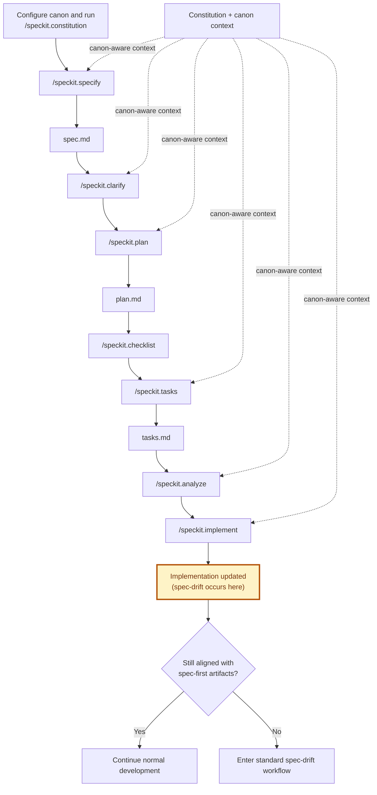
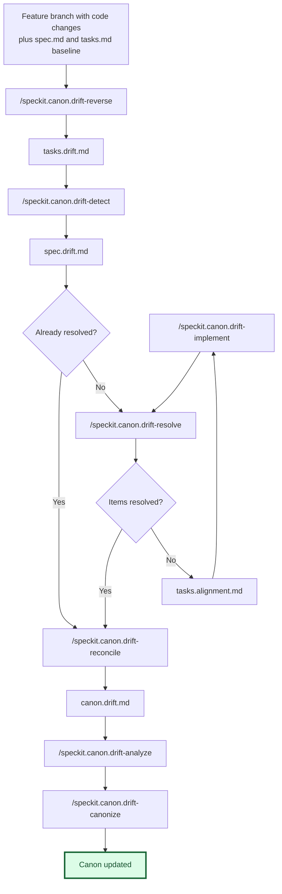
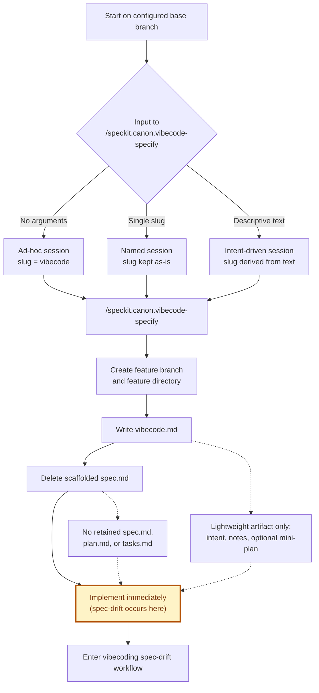
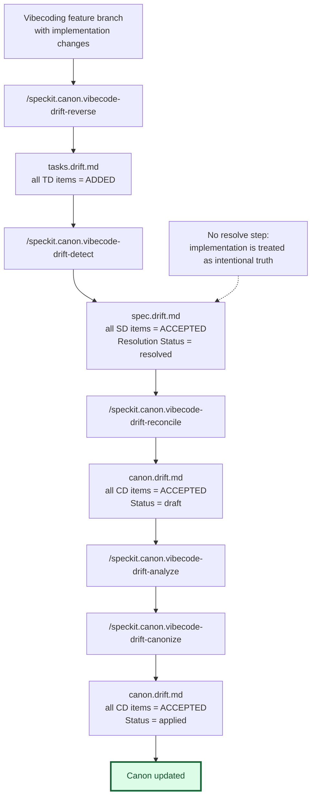
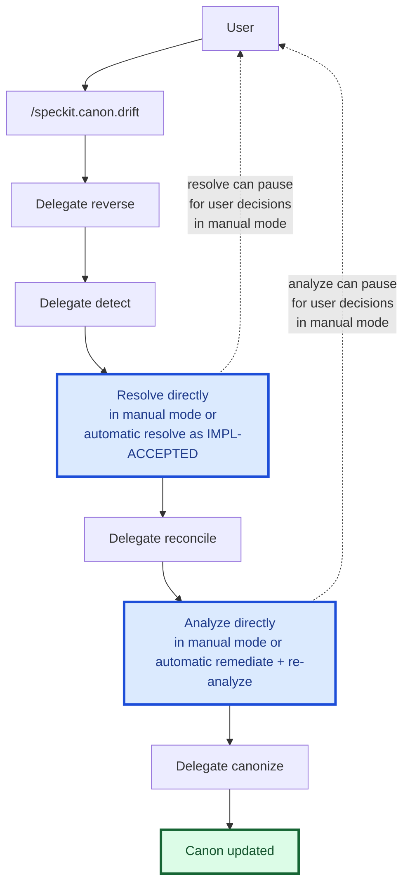
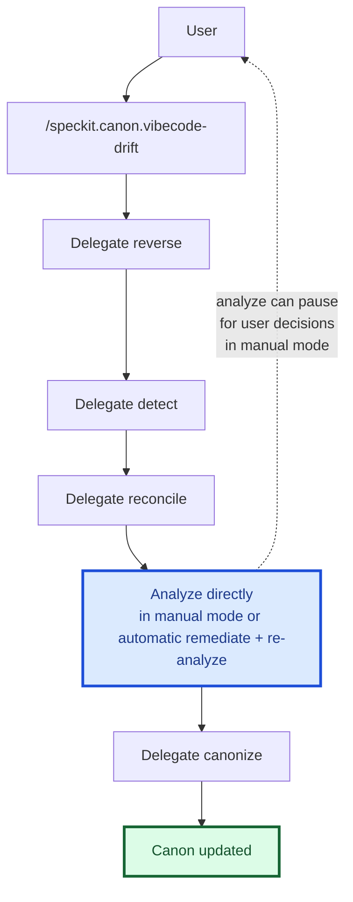
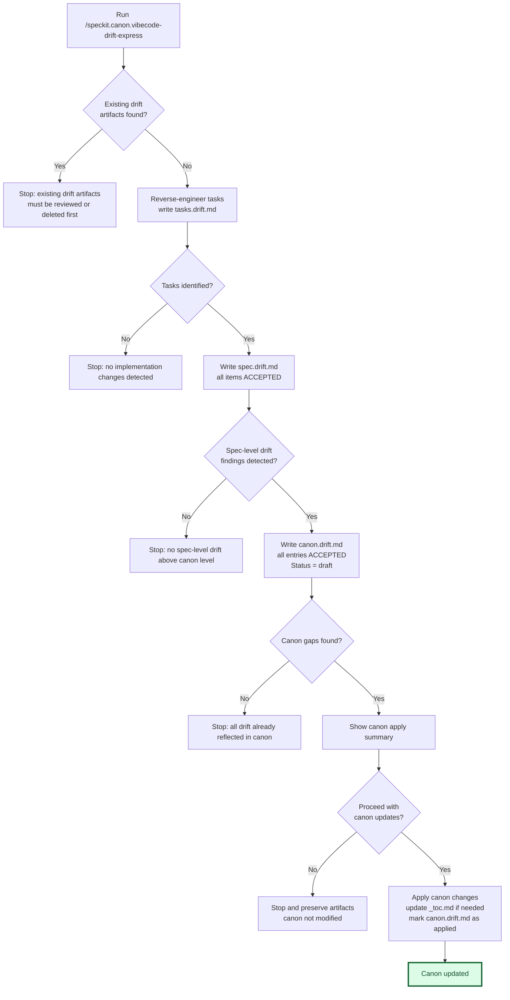
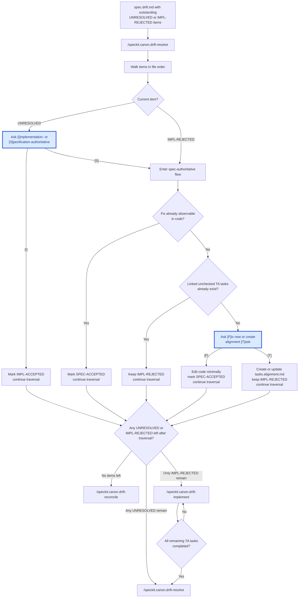
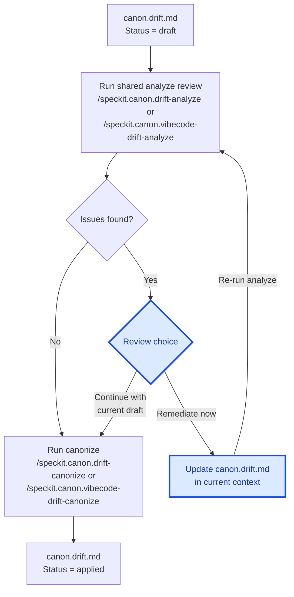

# Workflow Diagrams

This file summarizes the main Spec Kit Canon workflows as Mermaid diagrams.

## Legend

- Blue nodes mark user-facing review steps. In the manual path, these are the points where user action is needed.
- Green nodes mark successful resolved or canon-updated outcomes.
- Amber nodes mark where implementation drift occurs and the workflow enters drift recovery.

## Standard Spec-First Workflow

This is the normal canon-driven Spec Kit path. It keeps the familiar core
Spec Kit sequence and uses canon-aware configuration, constitution, and prompt
behavior throughout.

## Standard Spec-Drift Workflow

This is the recovery path when implementation has diverged from the original
`spec.md` and `tasks.md` baseline. This diagram shows the standard manual
user-facing flow at a high level: the main commands, the main drift artifacts,
and the primary handoff points between them. If `drift-detect` produces a
fully resolved `spec.drift.md`, the workflow goes straight to reconcile;
otherwise it shows the manual resolve/alignment path in simplified form, with
`drift-implement` as a separate follow-up command before returning to
`drift-resolve`. A detailed resolve/alignment diagram appears later in this
file. The shared analyze review cycle used by both
`/speckit.canon.drift-analyze` and `/speckit.canon.vibecode-drift-analyze`
is shown later as a separate diagram. Orchestration-specific automatic
behavior is shown later in `Orchestration Commands`.

## Vibecoding Code-First Workflow

This starts from the configured base branch, creates a feature branch and
feature directory, writes `vibecode.md`, and moves straight into coding.

## Vibecoding Spec-Drift Workflow

This is the canon-sync path after a code-first session. There is no resolve
phase because vibecoding treats implementation as intentional by default. The
diagram stays mode-agnostic after analyze; orchestration-specific branching is
shown later in `Orchestration Commands`. The shared analyze review cycle is
shown later as a separate diagram.

## Orchestration Commands

These are the two multi-step orchestrators. The standard drift orchestrator
owns both the resolve and analyze review steps directly; the vibecoding
orchestrator delegates reverse, detect, reconcile, and canonize but still runs
analyze directly before canonize. In both orchestrators, analyze stays
read-only and hands remediation items back to the orchestrator. This section
keeps the standard drift orchestrator intentionally high level; detailed manual
resolve and alignment follow-up behavior appears later in
`Drift-Resolve / Alignment Cycle`.

### `/speckit.canon.drift`

In explicit automatic orchestration mode, the orchestrator does not run
`/speckit.canon.drift-resolve`. Instead, it traverses remaining
`UNRESOLVED` and `IMPL-REJECTED` items in `spec.drift.md`, resolves them as
`IMPL-ACCEPTED`, treats the observed implementation as authoritative truth,
and then proceeds directly to `/speckit.canon.drift-reconcile` once the drift
file is fully resolved.

In explicit automatic orchestration mode, analyze still runs as a direct
read-only review step, but the orchestrator handles the remediation follow-up
itself. If analyze reports remediation items, the orchestrator applies every
reported item to `canon.drift.md`, re-runs analyze once for verification, and
continues to canonize only if that verification pass is clean; otherwise it
stops and preserves the revised draft for manual review.

### `/speckit.canon.vibecode-drift`

In explicit automatic orchestration mode, analyze still runs as a direct
read-only review step, but the orchestrator handles the remediation follow-up
itself. If analyze reports remediation items, the orchestrator applies every
reported item to `canon.drift.md`, re-runs analyze once for verification, and
continues to canonize only if that verification pass is clean; otherwise it
stops and preserves the revised draft for manual review.

## Express Vibecoding Spec-Drift

`/speckit.canon.vibecode-drift-express` is the low-ceremony single-invocation
path. It writes all drift artifacts, skips the separate draft canon analysis
pass, and asks only for final apply confirmation.

## Drift-Resolve / Alignment Cycle

This expands the manual black-box resolve step from the main standard
spec-drift diagram. It shows how `/speckit.canon.drift-resolve` walks
outstanding items, may fix implementation immediately, may defer work into
`tasks.alignment.md`, and then branches directly to the next command:
reconcile when everything is resolved, resolve again when unresolved
decisions remain, or implement when only alignment work remains. While
unchecked TA tasks remain, the alignment queue stays `pending` or
`in-progress`, so `drift-implement` loops on itself until the queue is fully
`implemented` and can be re-verified by `drift-resolve`.

## Shared Drift-Analyze Review Cycle

This expands the shared analyze review step used by both the standard
spec-drift and vibecoding spec-drift workflows. The logic is identical for
`/speckit.canon.drift-analyze` and `/speckit.canon.vibecode-drift-analyze`;
only the entrypoint and follow-up canonize command names differ.

